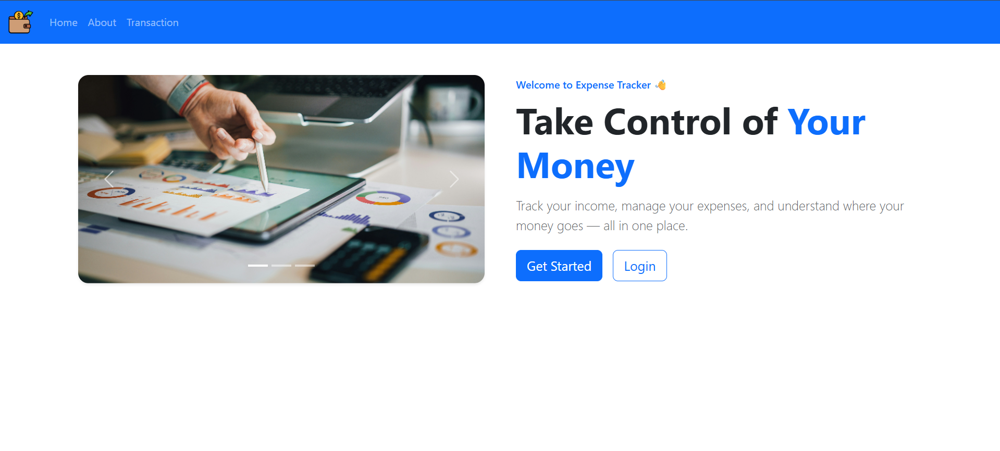
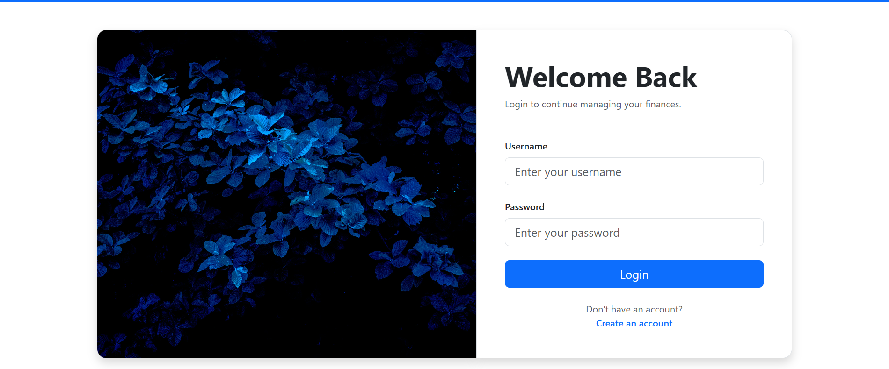
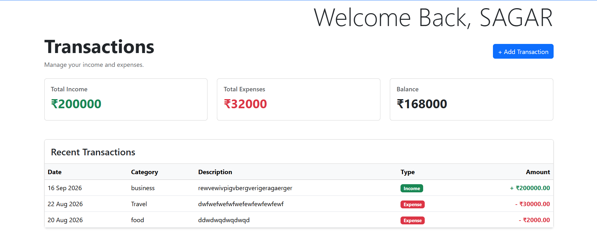
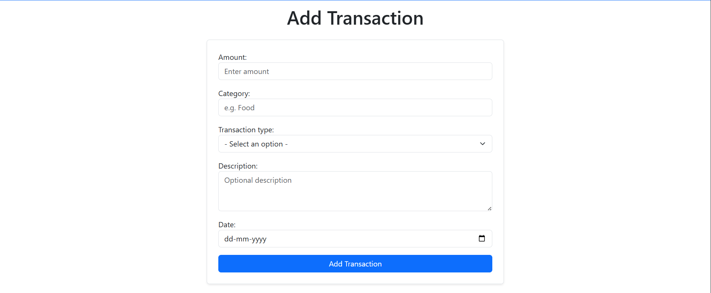
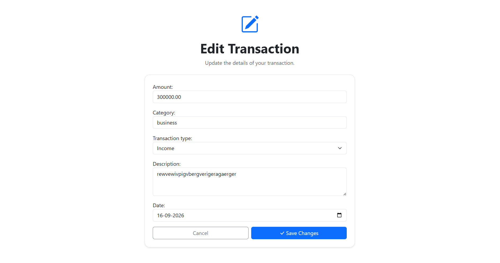
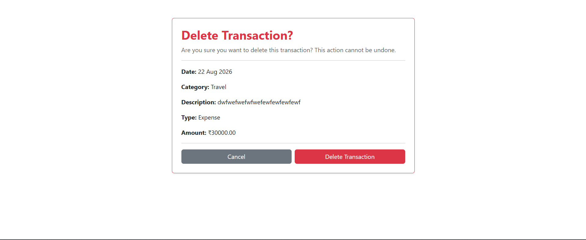

# 💰 Expense Tracker — V2

A simple **Django-based Expense Tracker** that allows users to create an account, log in, and manage their income and expenses.

**Version 2** builds upon the core functionality of Version 1 by introducing full transaction management, including **editing and deleting transactions**, along with improved transaction security and user experience.

---

## 🚀 Features

### 🔐 Authentication

* User registration
* User login
* User logout
* Authentication-protected transaction pages
* User-specific transactions
* Users can only access their own transactions

### 💸 Transaction Management

* Add income transactions
* Add expense transactions
* Edit existing transactions
* Delete existing transactions
* Delete confirmation page
* Transaction categories
* Transaction descriptions
* Transaction dates
* Transaction amounts
* Automatically associate transactions with the logged-in user
* Prevent users from accessing another user's transactions

### 📊 Dashboard

The transaction dashboard displays:

* Total income
* Total expenses
* Current balance
* Recent transactions
* Transaction type indicators
* Income and expense styling
* Add transaction button
* Edit transaction action
* Delete transaction action

### 🎨 UI

* Built with **Bootstrap 5**
* Responsive navigation bar
* Hero section
* Bootstrap carousel
* Login and registration pages
* Transaction dashboard
* Transaction form
* Edit transaction form
* Delete confirmation page
* Hover effects and cards
* Django message alerts
* Bootstrap Icons

---

## ✨ What's New in V2

Version 2 focuses on making transaction management more complete.

### Transaction Editing

Users can now edit an existing transaction and update:

* Amount
* Category
* Transaction type
* Description
* Date

The existing transaction is loaded into a Django `ModelForm` and populated automatically.

### Transaction Deletion

Users can now delete transactions.

Before deleting a transaction, the application displays a confirmation page containing the transaction details.

The user must explicitly confirm the deletion.

### Transaction Security

Transactions are filtered using both:

```python
transaction_id
user=request.user
```

This ensures that a user cannot access or modify another user's transaction simply by changing the transaction ID in the URL.

For example:

```python
get_object_or_404(
    Transaction,
    id=transaction_id,
    user=request.user
)
```

---

## 🛠️ Tech Stack

| Technology       | Purpose               |
| ---------------- | --------------------- |
| Python           | Programming language  |
| Django           | Backend web framework |
| SQLite           | Database              |
| Django Templates | Frontend templating   |
| Bootstrap 5      | UI and styling        |
| Bootstrap Icons  | Interface icons       |
| HTML             | Page structure        |
| CSS              | Custom styling        |

---

## 📂 Project Structure

```text
expense-tracker/
│
├── config/
│   ├── settings.py
│   ├── urls.py
│   ├── asgi.py
│   └── wsgi.py
│
├── home/
│   ├── templates/
│   ├── static/
│   ├── views.py
│   └── urls.py
│
├── transactions/
│   ├── templates/
│   ├── models.py
│   ├── forms.py
│   ├── views.py
│   └── urls.py
│
├── users/
│   ├── templates/
│   ├── forms.py
│   ├── views.py
│   └── urls.py
│
├── templates/
│   └── base.html
│
├── screenshots/
│   ├── home.png
│   ├── login.png
│   ├── register.png
│   ├── transactions.png
│   ├── add-transaction.png
│   ├── edit-transaction.png
│   └── delete-transaction.png
│
├── manage.py
├── db.sqlite3
└── README.md
```

> The exact structure may vary depending on your Django app organization.

---

## 🗄️ Transaction Model

Each transaction contains:

* User
* Amount
* Category
* Transaction type
* Description
* Date
* Creation timestamp

The transaction type currently supports:

```text
INCOME
EXPENSE
```

Transactions are connected to Django's built-in `User` model using a foreign key.

```python
user = models.ForeignKey(
    User,
    on_delete=models.CASCADE,
    related_name="transactions",
)
```

This means every user has their own separate collection of transactions.

---

## 📊 Transaction Calculations

The dashboard calculates:

```text
Total Income
      ↓
Total Expenses
      ↓
Balance = Income - Expenses
```

For example:

```text
Income     = ₹25,000
Expenses   = ₹12,500
--------------------
Balance    = ₹12,500
```

The calculations are performed using Django's ORM aggregation functionality and `Sum()`.

---

## 🔄 Transaction CRUD Flow

Version 2 supports the complete basic CRUD workflow for transactions:

```text
                ┌───────────────┐
                │     Create    │
                └───────┬───────┘
                        ↓
                ┌───────────────┐
                │      Read     │
                └───────┬───────┘
                        ↓
                ┌───────────────┐
                │     Update    │
                └───────┬───────┘
                        ↓
                ┌───────────────┐
                │     Delete    │
                └───────────────┘
```

### Create

Users can add new income or expense transactions.

### Read

Users can view their transactions on the transaction dashboard.

### Update

Users can open an existing transaction and modify its details.

### Delete

Users can delete a transaction after confirming the deletion.

---

## 🔑 Authentication Flow

The basic user flow is:

```text
Register
   ↓
Login
   ↓
Transactions Dashboard
   ↓
Add Transaction
   ↓
View Transaction
   ↓
Edit / Delete Transaction
   ↓
Dashboard Updated
```

Users can only see and manage the transactions associated with their own account.

---

## 🔒 Transaction Security

Transaction-related views verify both the transaction ID and the currently authenticated user.

For example:

```python
transaction = get_object_or_404(
    Transaction,
    id=transaction_id,
    user=request.user
)
```

This prevents a user from accessing another user's transaction by manually changing the transaction ID in the URL.

For example:

```text
/transactions/edit/15/
```

If transaction `15` belongs to another user, Django returns a `404` response instead of exposing the transaction.

The same ownership check is applied to transaction deletion.

---

## ⚙️ Installation

### 1. Clone the repository

```bash
git clone <your-repository-url>
```

### 2. Enter the project directory

```bash
cd expense-tracker
```

### 3. Create a virtual environment

Windows:

```bash
python -m venv venv
```

Activate it:

```bash
venv\Scripts\activate
```

Linux/macOS:

```bash
python3 -m venv venv
source venv/bin/activate
```

### 4. Install dependencies

```bash
pip install django
```

If the project contains a `requirements.txt` file:

```bash
pip install -r requirements.txt
```

### 5. Run migrations

```bash
python manage.py migrate
```

### 6. Create a superuser

```bash
python manage.py createsuperuser
```

### 7. Start the development server

```bash
python manage.py runserver
```

Then open:

```text
http://127.0.0.1:8000/
```

---

## 📸 Screenshots

### 🏠 Home Page & Hero Section

<p align="center">
  
</p>

### 🔐 Authentication

<p align="center">
  
  &nbsp;&nbsp;
  
</p>

### 📊 Transactions Dashboard

<p align="center">
  
</p>

### 💸 Add Transaction

<p align="center">
  
</p>

### ✏️ Edit Transaction

<p align="center">
  
</p>

### 🗑️ Delete Transaction

<p align="center">
  
</p>

---

## 🧠 What I Learned

While building Version 1 and Version 2, I worked with:

* Django project and app structure
* Django URL routing
* Django templates
* Template inheritance
* Static files
* Django authentication
* Login and logout
* Django messages framework
* Django forms
* ModelForms
* Populating ModelForms with existing model instances
* Django ORM
* ForeignKey relationships
* QuerySets
* `filter()`
* `get_object_or_404()`
* `aggregate()`
* `Sum()`
* Authentication decorators
* User-specific database queries
* CRUD operations
* Bootstrap integration
* Bootstrap components
* Bootstrap Icons
* Responsive layouts
* Form validation
* Transaction ownership and access control

---

## 🔮 Future Improvements — V3

Possible improvements for the next version:

* [ ] Search transactions
* [ ] Filter by category
* [ ] Filter by transaction type
* [ ] Filter by date
* [ ] Pagination
* [ ] Monthly expense reports
* [ ] Expense charts
* [ ] Category-wise spending analysis
* [ ] Better dashboard
* [ ] User profile
* [ ] Password reset
* [ ] Improved form validation
* [ ] REST API
* [ ] React/Next.js frontend
* [ ] PostgreSQL database
* [ ] Deployment

---

## 📚 Version History

### v2.0.0

Version 2 introduced complete basic transaction CRUD functionality.

**Added:**

* Edit transactions
* Delete transactions
* Delete confirmation page
* Populated edit forms
* Transaction ownership protection
* Improved transaction actions
* Improved dashboard UI
* Bootstrap Icons

**Focus:**

> **Transaction CRUD + Security + Improved User Experience**

---

### v1.0.0

The initial version focused on the core functionality of the application.

**Included:**

* User registration
* User login
* User logout
* Authentication-protected pages
* Add transactions
* View transactions
* Income and expense calculations
* Balance calculation
* Basic dashboard
* Bootstrap UI
* Django messages

**Focus:**

> **Authentication + Transaction Management + Basic Dashboard**

---

## 📌 Version

**Current Version:** `v2.0.0`

The current release provides:

> **Authentication + Transaction CRUD + Dashboard + Transaction Security**

---

## 👨‍💻 Author

**Sagar Dey**

Built as a learning project to practice:

**Django • Python • Databases • Authentication • ORM • CRUD • Bootstrap**

---

## ⭐ Future Goal

The long-term goal is to turn this simple tracker into a more complete personal-finance application with:

* Advanced analytics
* Charts and visualizations
* Budgeting tools
* Monthly financial reports
* Category-based spending analysis
* REST API
* Modern frontend
* PostgreSQL
* Production deployment

The project will continue evolving as new Django and full-stack development concepts are learned.
